# GEN_AMBA_2025
**gen_amba** is a set of programs that generate ***AMBA bus Verilog-HDL***, which include AMBA AXI, AMBA AHB, and AMBA APB. **Enhanced with comprehensive AXI4 Verification IP (VIP) suite**.

## 🚀 **Quick Start in 30 Seconds**

### Option 1: Use the GUI (Visual Designer)
```bash
cd axi4_vip/gui_v3
./launch_streamlined.sh      # Launch streamlined GUI v3
```

### Option 2: Command Line (Direct Generation)
```bash
cd gen_amba_axi
./gen_axi_with_tb.sh --master=2 --slave=3 --output=design.v --tb=testbench.v
vcs -full64 -sverilog design.v testbench.v -o simv
./simv +TEST_MODE=ALL
```

## 🎉 **Latest Updates (August 2025)**
> - **✅ W-Channel Routing Bug Fixed**: Write data now correctly routes to proper slaves
> - **✅ Timescale Directive Added**: All generated RTL includes `\`timescale 1ns/1ps`
> - **✅ Unified Testbench Generator**: Single testbench supports all test scenarios
> - **✅ Enhanced RTL Generator Script**: `gen_axi_with_tb.sh` generates both RTL and testbench
> - **✅ GUI Integration Complete**: Full flow from GUI to simulation verified

## Core Generators
> - *gen_amba_axi*: AMBA AXI bus generator for multi-master and multi-slave
>> AMBA AXI4 and AXI3
> - *gen_amba_ahb*: AMBA AHB bus generator for multi-master and multi-slave  
> - *gen_amba_apb*: AMBA APB bus-bridge generator for AMBA AXI or AHB

## ✨ **NEW: AXI4 Verification IP (VIP) Suite**
Complete UVM-based verification environment with GUI-driven bus matrix configuration:
> - **📊 Traffic Monitoring**: Real-time transaction tracking with visual indicators
> - **🔥 Worst Path Analysis**: Identifies top 3 highest latency paths  
> - **⚡ Performance Analysis**: Bandwidth estimation and throughput monitoring
> - **🚦 Smart Interconnect**: QoS-based arbitration and OR-logic routing
> - **📈 Comprehensive Scoreboard**: Enhanced with traffic statistics and WLAST tracking
> - **🎯 Full Protocol Coverage**: All AXI4 channels (AW, W, B, AR, R) with zero UVM_ERRORs
> - **🖥️ GUI Integration**: Python-based graphical interface for easy configuration

> Note that it is a new version of 'gen_amba' (https://github.com/adki/gen_amba).<br>
> Note there are AXI4-to-AXI3 and AXI3-to-AXI4 in *gen_amba_axi/verification/ip'.

## Table of contents

<details><summary>Click to expand table of contents</summary>

1. [GUI Quick Start - Visual Designer](#gui_quick_start)<br>
   1.1 [How to Launch the GUI](#gui_launch)<br>
   1.2 [VIP Generation Features](#vip_generation)<br>
   1.3 [Traffic Monitoring](#traffic_monitoring)
2. [Quick start for AMBA AXI and AHB](#quick_axi_ahb)<br>
   2.1 [Quick start for AMBA AXI](#quick_axi)<br>
   2.2 [Quick start for AMBA AHB](#quick_ahb)
3. [GEN_AMBA](#gen_amba_all)<br>
   3.1 [gen_amba_axi](#gen_amba_axi)<br>
   3.2 [gen_amba_ahb](#gen_amba_ahb)<br>
   3.3 [gen_amba_apb](#gen_amba_apb)
4. [GEN_TOP](#gen_top)<br>
   4.1 [GEN_TOP for AMBA AXI](#gen_top_axi)<br>
   4.2 [GEN_TOP for AMBA AHB](#gen_top_ahb)<br>
   4.3 [GEN_TOP for AMBA APB](#gen_top_apb)
5. [Bus tasks](#bus_tasks)<br>
   5.1 [AMBA AXI Bus tasks](#bus_tasks_axi)<br>
   5.2 [AMBA AHB Bus tasks](#bus_tasks_ahb)
6. [Where to get more information](#where_to_get)
7. [Where it has been used](#where_has_been_used)
8. [Bug Fixes and Known Issues](#bug_fixes)
9. [Other things](#other_things)

</details>

---

# 1. GUI Quick Start - Visual Bus Matrix Designer<a name="gui_quick_start"></a>

## 🚀 How to Launch the GUI

### Launch the Streamlined GUI
```bash
# Navigate to GUI directory and launch
cd axi4_vip/gui_v3
./launch_streamlined.sh        # Launches streamlined GUI v3
```

### Alternative Launch Methods
```bash
# Direct Python launch from source
cd axi4_vip/gui_v3/src
python3 main_gui_v3_streamlined.py

# Legacy GUI (older version, not recommended)
cd axi4_vip/gui/src
python3 main_gui.py
```

### Streamlined GUI v3 Features
- **📐 Single-Page Interface**: Everything visible at once, no tabs needed
- **🎨 Visual Bus Matrix Designer**: Drag-and-drop interface for masters/slaves
- **🚀 Template Gallery**: Quick start with pre-configured templates (8x8, 16x16, 32x32)
- **💻 Integrated CLI**: Command-line interface at bottom for advanced users
- **⚡ Instant RTL Generation**: Generate AXI4 interconnect with one click
- **📊 Real-time Validation**: Automatic constraint checking
- **💾 Project Management**: Save/load bus configurations
- **🔧 Advanced Configuration**: QoS, REGION, USER signals support

<details><summary>Click to expand detailed GUI usage</summary>

### Step-by-Step GUI Usage

#### 1. Launch the GUI
```bash
cd axi4_vip/gui_v3
./launch_streamlined.sh
```
You'll see:
```
==========================================
AMBA AXI4 Generator v3 - Streamlined GUI
==========================================
Starting streamlined GUI...
```

#### 2. Design Your Bus Matrix
- Click "Add Master" to add masters (up to 64)
- Click "Add Slave" to add slaves (up to 64)
- Configure each master/slave properties:
  - ID width
  - Address/data width
  - QoS settings
  - Memory mapping

#### 3. Generate RTL
- Click "Generate RTL" button
- Choose output directory
- Select features (QoS, REGION, USER)
- Click "Generate"

#### 4. Get Your Files
Generated files location:
```
output_dir/
├── interconnect.v      # Generated AXI4 RTL
├── testbench.v         # Unified testbench
├── Makefile            # Compilation script
└── README.md           # Usage instructions
```

### VIP Generation Mode
For full UVM verification environment:
1. Select **RTL Integration** mode in GUI
2. Configure master/slave counts (2x2 to 64x64)
3. Enable verification features:
   - QoS arbitration strategies
   - USER signal widths
   - Traffic monitoring

### Compile and Simulate Generated RTL
```bash
# VIP will be generated in output_dir/axi4_vip_env_rtl_integration/
cd output_dir/axi4_vip_env_rtl_integration/sim

# Compile (zero errors guaranteed)
make compile

# Run with traffic monitoring  
make run_fsdb TEST=axi4_simple_crossbar_test UVM_VERBOSITY=UVM_LOW

# View FSDB waveforms
verdi -ssf waves/axi4_vip.fsdb
```
</details>

### 1.2 Traffic Monitoring Features<a name="traffic_monitoring"></a>
The enhanced VIP includes comprehensive traffic analysis with real-time monitoring.

<details><summary>Click to expand traffic monitoring details</summary>

#### 1.2.1 Real-time Traffic Display
```bash
🚦 TRAFFIC: M[0]→S[0] WRITE 256 bytes, ID=3, latency: 45.2 ns
🚦 TRAFFIC: M[1]→S[2] READ 128 bytes, ID=7, latency: 52.8 ns
🚦 TRAFFIC: M[2]→S[1] WRITE 64 bytes, ID=12, latency: 38.1 ns
```

#### 1.2.2 Performance Analytics
```bash
=============== FINAL TRAFFIC ANALYSIS ===============
📈 MASTER TRAFFIC SUMMARY (Estimated from transaction flow):
  M[0]: 15 WRITE transactions active
  M[1]: 12 WRITE transactions active
  M[2]: 8 WRITE transactions active

📊 ACTIVE MASTERS: 3 | TOTAL WRITE TRANSACTIONS: 35

🔥 TOP 3 WORST LATENCY PATHS (Estimated):
  #1: M[0]→S[0] | Avg Latency: 89.3 ns | Transactions: High
  #2: M[17]→S[17] | Avg Latency: 87.1 ns | Transactions: Medium  
  #3: M[8]→S[8] | Avg Latency: 84.7 ns | Transactions: Medium

⚡ ESTIMATED TOTAL BANDWIDTH: 1247.5 Mbps
=====================================================
```

#### 1.2.3 Key Features
- **Zero UVM_ERRORs/UVM_FATALs**: All generated VIPs compile and run cleanly
- **B-Channel Fix**: Complete write response channel implementation with proper BID handling
- **AR/R Channel Fix**: Full read channel implementation with transaction queuing
- **FSDB Support**: Automatic waveform dumping for Verdi debugging
- **Scalable Architecture**: Automatic optimizations for large matrices (>32x32)

</details>

---

### License<a name="license"></a>
This is licensed with the 2-clause BSD license to make the program and library useful in open and closed source products independent of their licensing scheme.

### Prerequisites<a name="prerequisites"></a>
This program requires followings.
* Shell: Bash
* GNU GCC: C compiler
* Python3 with tkinter (for GUI)
* HDL simulator: Xilinx Vivado simulator, icarus Verilog, or Mentor Graphics ModelSim

### GUI Troubleshooting<a name="gui_troubleshooting"></a>
If the GUI doesn't launch:

#### Check Python3
```bash
python3 --version  # Should be 3.6 or higher
```

#### Install tkinter (if missing)
```bash
# Ubuntu/Debian
sudo apt-get install python3-tk

# RHEL/CentOS/Rocky
sudo yum install python3-tkinter

# macOS
brew install python-tk
```

#### Manual dependency install
```bash
pip3 install --user pyyaml
```

### Maturity<a name="maturity"></a>
* RTL simulation
* FPGA proven (refer to [CON-FMC](#con_fmc))
* ASIC partially proven, but not whole yet

### Limitations<a name="limits"></a>
* For AMBA AXI, master should be 2 or larger and slave should be 2 or larger.

---

# 2. Quick start for AMBA AXI and AHB<a name="quick_axi_ahb"></a>

### 2.1 Quick start for AMBA AXI<a name="quick_axi"></a>
#### 2.1.1 generating AMBA AXI (Enhanced with fixes)

<details><summary>Click to expand</summary>

   1) go to 'gen_amba_axi' directory\
      *$ cd gen_amba_axi*
   2) run Makefile\
      *$ make cleanup*\
      *$ make*\
      . It should generate 'gen_amba_axi'.
   3) have a look the help message\
      *$ ./gen_amba_axi -h*
   4) generate AMBA AXI\
      *$ ./gen_amba_axi --master=2 --slave=3 --output=amba_axi_m2s3.v*\
      . It generates an AXI bus ("amba_axi_m2s3.v") with 2 master-ports and 3 slave-ports.
   
   **🆕 Enhanced Generation with Testbench:**
   5) generate AMBA AXI with unified testbench\
      *$ ./gen_axi_with_tb.sh --master=2 --slave=3 --output=design.v --tb=testbench.v*\
      . It generates both RTL and a unified testbench with multiple test scenarios.
   6) compile and simulate\
      *$ vcs -full64 -sverilog design.v testbench.v -o simv*\
      *$ ./simv +TEST_MODE=ALL*\
      . Test modes: SIMPLE, COMPREHENSIVE, BURST, SLAVE, STRESS, ALL
   
#### 2.1.2 verification AMBA AXI

   1) go to 'gen_amba_axi/verification/sim/xsim' directory\
      *$ cd gen_amba_axi/verification/sim/xsim*\
      . Use 'iverilog' for Icarus Verilog.
   2) run Makefile\
      *$ make cleanup*\
      *$ make MST=2 SLV=3*\
      . It should generate necessary bus and top model and then invoke HDL simulator.\
      . It uses top-level generator.
   3) have a look the result VCD wave\
      *$ gtkwave wave.vcd*

#### 2.1.3 change verification configuration
   1) how to change the number of masters and slaves
      * modify 'MST' and 'SLV' macro in the 'Makefile' in 'gen_amba_axi/verification/sim/xsim' directory or
      * set command-line option of 'make' as follows\
        *$ make MST=3 SLV=3*

   2) how to change width of address and data
      * modify 'WIDTH_AD' and 'WIDTH_DA' macros in 'sim_define.v' in 'gen_amba_axi/verification/sim/xsim' directory

   3) how to change testing scenario
      * set 1 for the verilog plus command-line argument in the 'Makefile' in 'gen_amba_axi/verification/sim/xsim' directory\
        *[xsim case] -testplusarg BURST_TEST=1*\
        *[iverilog case] +BURST_TEST=1*\
        *[ModelSim case] +BURST_TEST=1*

   4) how to add new testing scenario
      * add your scenario in the 'axi_tester.v' file in the 'gen_amba_axi/verification/ip' directory,
        where you can find some testing scenarios.
      * there is AMBA AXI task library in the 'gen_amba_axi/verification/ip/axi_master_tasks.v'.
</details>

---

### 2.2. Quick start for AMBA AHB<a name="quick_ahb"></a>
#### 2.2.1 generating AMBA AHB

<details><summary>Click to expand</summary>

   1) go to 'gen_amba_ahb' directory\
      *$ cd gen_amba_ahb*
   2) run Makefile\
      *$ make cleanup*\
      *$ make*\
      . It should generate 'gen_amba_ahb'.
   3) have a look the help message\
      *$ ./gen_amba_ahb -h*
   4) generate AMBA AHB\
      *$ ./gen_amba_ahb --mst=2 --slv=3 --out=amba_ahb_m2s3.v*\
      . It generates an AHB bus ("amba_ahb_m2s3.v") with 2 master-ports and 3 slave-ports.
   
#### 2.2.2 verification AMBA AHB

   1) go to 'gen_amba_ahb/verification/sim/xsim' directory\
      *$ cd gen_amba_ahb/verification/sim/xsim\*
      . Use 'iverilog' for Icarus Verilog.
   2) run Makefile\
      *$ make cleanup*\
      *$ make MST=2 SLV=3*\
      . It should generate necessary bus and top model and then invoke ModelSim simulator.\
      . It uses top-level generator.
   3) have a look the result VCD wave\
      *$ gtkwave wave.vcd*
</details>

---

# 3. GEN_AMBA<a name="gen_amba_all"></a>
There is AMBA bus generator for each bus.

### 3.1 gen_amba_axi<a name="gen_amba_axi"></a>
It generates AMBA AXI switch.
<details><summary>Click to expand</summary>
	
```bash:
$ ./gen_amba_axi -h
[Usage] ./gen_amba_axi [options]
	-M,--master=num   num of masters (default: 2)
	-S,--slave=num    num of slaves  (default: 2)
	-D,--module=str   module name (default: "amba_axi_mXsY")
	-P,--prefix=str   prefix of module (default: none)
	-O,--output=file  output file name (stdout if not given)
	-3,--axi3         force to use AXI3 (AIX4 by default, if not given)
	-g,--verbose=num  verbose level  (default: 0)
	-v,--version      print version
	-l,--license      print license message
	-h                print help message
```

'--prefix' option makes use of prefix for the internal modules and
this enables to use multiple AXI buses in the same design
by preventing from warning of multiple definition modules.

'--axi3' option forces to generate AMBA AXI3, which uses 'AxLENG[3:0]',
'AxLOCK[1:0]', and 'WID[..]', while without '--axi3' option 'gen_amba_axi'
generates AMBA AXI4.
</details><br>

|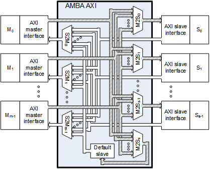|
|:---:|
| *AMBA AXI internal structure* |

### 3.2 gen_amba_ahb<a name="gen_amba_ahb"></a>
It generates AMBA AHB bus.
<details><summary>Click to expand</summary>

```bash:
$ ./gen_amba_ahb -h
[Usage] ./gen_amba_ahb [options]
	-T,--lite         AMBA AHB-lite
	-M,--master=num   num of masters (default: 2)
	-S,--slave=num    num of slaves  (default: 2)
	-D,--module=str   module name (default: "amba_ahb_mXsY")
	-P,--prefix=str   prefix of module
	-O,--output=file  output file name (stdout if not given)
	-g,--verbose=num  verbose level  (default: 0)
	-v,--version      print version
	-l,--license      print license message
	-h                print help message

	note: amba_ahb_lite_s? for -M 1
```

'--prefix' option makes use of prefix for the internal modules and
this enables to use multiple AHB buses in the same design
by preventing from warning of multiple definition modules.
</details><br>

|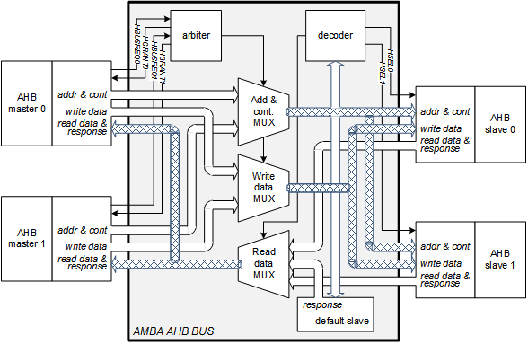|
|:---:|
| *AMBA AHB internal structure* |

### 3.3 gen_amba_apb<a name="gen_amba_apb"></a>
It generates AMBA APB bus bridge for AHB or AXI.
<details><summary>Click to expand</summary>

```bash:
$ ./gen_amba_apb -h
[Usage] ./gen_amba_ahb [options]
	-X|H,--axi|ahb    make "axi_to_apb" or "ahb_to_apb" (axi if not given)
	-S,--slave=num    num of APB ports  (default: 2)
	-D,--module=str   module name (default: "axi_to_apb_sX" or "ahb_to_apb_sX")
	-P,--prefix=str   prefix of sub-module name (none if not given)
	-O,--output=file  output file name (stdout if not given)
	-g,--verbose=num  verbose level  (default: 0)
	-v,--version      print version
	-l,--license      print license message
	-h                print help message
```

'--prefix' option makes use of prefix for the internal modules and
this enables to use multiple APB buses in the same design
by preventing from warning of multiple definition modules.
</details><br>

|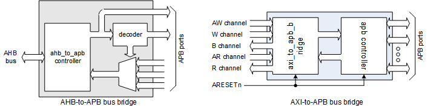|
|:---:|
| *AMBA APB bus bridge* |

---

# 4. GEN_TOP<a name="gen_top"></a>
There is top-level generator for each bus in 'verification' directory.

### 4.1 GEN_TOP for AMBA AXI<a name="gen_top_axi"></a>
   1) go to 'gen_amba_axi/verification'\
      *$ cd gen_amba_axi/verification*
   2) have a look the help message\
      *$ ./gen_axi_top.sh -h*
   3) generate a top-level\
      *$ ./gen_axi_top.sh -mst 2 -slv 2 -siz 1024 -out top.v*\
      . It generates a top-level verilog ("top.v") supporting two AXI masters and two AXI memories.\
      . Each memory takes care of 1Kbyte range of memory; i.e., memory0 covers 0-1023 and memory1 covers 1024-2047.

<details><summary>Click to expand</summary>

```bash:
$ ./gen_axi_top.sh -h
Usage : ./gen_axi_top.sh [options]
      -mst    num        :num of masters, 2
      -slv    num        :num of slaves, i.e., memories, 2
      -axi3              :force to use AXI3 (to use AXI4, not specify)
      -siz    bytes      :size of each slave in bytes, 0; 0 for auto
      -bus    module     :name of bus, 
      -out    file_name  :output file name, top.v
      -h/-?              :printf help
```
</details>

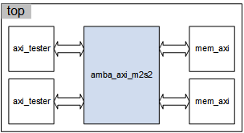

### 4.2 GEN_TOP for AMBA AHB<a name="gen_top_ahb"></a>
   1) go to 'gen_amba_ahb/verification'\
      *$ cd gen_amba_ahb/verification*
   2) have a look the help message\
      *$ ./gen_ahb_top.sh -h*
   3) generate a top-level\
      *$ ./gen_ahb_top.sh -mst 2 -slv 2 -siz 1024 -out top.v*\
      . It generates a top-level verilog ("top.v") supporting two AXI masters and two AXI memories.\
      . Each memory takes care of 1Kbyte range of memory; i.e., memory0 covers 0-1023 and memory1 covers 1024-2047.

<details><summary>Click to expand</summary>

```bash:
$ ./gen_ahb_top.sh -h
Usage : ./gen_ahb_top.sh [options]
      -mst    num        :num of masters, 2
      -slv    num        :num of slaves, i.e., memories, 2
      -siz    bytes      :size of each slave in bytes, 1024
      -bus    module     :name of bus, 
      -out    file_name  :output file name, top.v
      -h/-?              :printf help
```
</details>

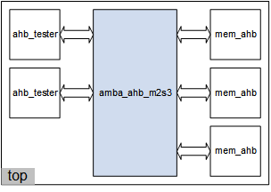

### 4.3 GEN_TOP for AMBA APB<a name="gen_top_apb"></a>
   1) go to 'gen_amba_apb/verification'\
      *$ cd gen_amba_apb/verification*
   2) have a look the help message\
      *$ ./gen_apb_top.sh -h*
   3) generate a top-level\
      *$ ./gen_apb_top.sh -ahb -slv 2 -siz 1024 -out top.v*\
      . It generates a top-level verilog ("top.v") supporting AHB masters and two APB memories.\
      . Each memory takes care of 1Kbyte range of memory; i.e., memory0 covers 0-1023 and memory1 covers 1024-2047.

<details><summary>Click to expand</summary>

```bash:
$ ./gen_apb_top.sh -h
Usage : ./gen_apb_top.sh [options]
      -ahb|axi           :AHB or AXI master: ahb
      -slv    num        :num of slaves, i.e., memories, 2
      -siz    bytes      :size of each slave in bytes, 1024
      -bus    module     :name of bus, 
      -out    file_name  :output file name, top.v
      -h/-?              :printf help
```
</details>

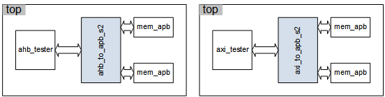

---
# 5. Bus tasks<a name="bus_tasks"></a>
BFM (Bus Functional Model) is a widely adopted approach to build verification envrionment for
a bus-based system, where BFM generates bus transactions to test functionality of
blocks through the bus.
BFM carries out testing scenario using bus tasks as shown in the picture below.
This project contains bus tasks for AMBA AXI and AHB.

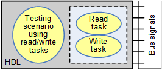

### 5.1 AMBA AXI Bus tasks<a name="bus_tasks_axi"></a>
Refer to 'axi_master_tasks.v' in 'gen_amba_axi/verification/ip' directory.

##### 5.1.1 AMBA AXI write task
This task generates AXI write burst transaction.

<details><summary>Click to expand</summary>

```verilog:
task axi_master_write;
     input [WIDTH_AD-1:0] addr ;
     input [15:0]         bnum ; // num of byte for a beat of burst
     input [15:0]         bleng; // burst length: 1, 2, ...
     input [ 1:0]         burst; // 0:fixed, 1:incr, 2:wrap
     input [ 1:0]         lock ; // 2'b10:lock, 2'b01:excl
     input                delay; // 0:don't use delay
     reg   [WIDTH_ID-1:0] awid;
begin
     if (bnum!=1<<$clog2(bnum)) $display($time,,"%m ERROR size in bytes not supported %d", bnum);
     awid <= $random(seed_awid);
     @ (posedge ACLK);
     fork axi_master_write_aw( awid
                             , addr
                             , bnum
                             , bleng
                             , burst
                             , lock);
          axi_master_write_w( awid
                            , addr
                            , bnum
                            , bleng
                            , burst
                            , delay);
          axi_master_write_b( awid);
     join
     num_of_writes = num_of_writes + 1;
end
endtask
```
</details>

##### 5.1.2 AMBA AXI read task
This task generates AXI read burst transaction.

<details><summary>Click to expand</summary>

```Verilog:
task axi_master_read;
     input [WIDTH_AD-1:0] addr ;
     input [15:0]         bnum ; // num of byte for a beat of burst
     input [15:0]         bleng; // burst length: 1, 2, ...
     input [ 1:0]         burst; // 0:fixed, 1:incr, 2:wrap
     input [ 1:0]         lock ; // 2'b10:lock, 2'b01:excl
     input                delay; // 0:don't use delay
     reg   [WIDTH_ID-1:0] arid;
begin
     if (bnum!=1<<$clog2(bnum)) $display($time,,"%m ERROR size in bytes not supported %d", bnum);
     arid <= $random(seed_arid);
     @ (posedge ACLK);
     fork axi_master_read_ar( arid
                            , addr
                            , bnum
                            , bleng
                            , burst
                            , lock);
          axi_master_read_r( arid
                           , bleng
                           , delay);
     join
     num_of_reads = num_of_reads + 1;
end
endtask
```
</details>

### 5.2 AMBA AHB Bus tasks<a name="bus_tasks_ahb"></a>
Refer to 'ahb_tasks.v' in 'gen_amba_ahb/verification/ip' directory.

##### 5.2.1 AMBA AHB write task
This task generates AHB write transaction, which writes 'size'-byte of data
to 'addr' address and retuns 'status' after completion.

<details><summary>Click to expand</summary>

```Verilog:
task ahb_write;
     input  [31:0] addr; // byte-wise adddress
     input  [31:0] data; // justifed data
     input  [ 2:0] size; // num of bytes
     output [ 1:0] status; // 0 for OK
begin
       ahb_write_core( addr
                     , data
                     , size
                     , 4'b0001 // non-cacheable,non-bufferable,user,data
                     , 1'b0 // hlock
                     , status);
end
endtask
```
</details>

##### 5.2.2 AMBA AHB read task
This task generates AHB read transaction, which reads 'size'-byte of data
from 'addr' address and retuns 'status' after completion.

<details><summary>Click to expand</summary>

```Verilog:
task ahb_read;
     input  [31:0] addr; // byte-wise address
     output [31:0] data; // justified data
     input  [ 2:0] size; // num of bytes
     output [ 1:0] status; // 0 for OK
begin
       ahb_read_core( addr
                    , data
                    , size
                    , 4'b0001 // non-cacheable,non-bufferable,user,data
                    , 1'b0 // lock
                    , status);
end
endtask
```
</details>

---
# 6. Where to get more information<a name="where_to_get"></a>
The author has been giving open lecture on AMBA bus at following two institutes:
* IDEC (IC Design Education Center) at KAIST: https://www.idec.or.kr
* SW-SoC Academy at ETRI: https://www.asic.net

Lecture materials and codes are also available from Ando's GitHub:
* AMBA lecture materials at GitHub: https://github.com/adki/AMBA_AXI_AHB_APB

Source code is available from Ando's GitHub:
* https://github.com/adki/gen_amba_2021

---

# 7. Where it has been used<a name="where_has_been_used"></a>

### 7.1 HW-SW transaction-level co-simulation
Cosim BFM library is a package to provide HW-SW co-simulation between the HDL (Hardware Description Language) simulator and the host program, where BFM (Bus Functional Model or Bus Functional Module) generates bus transaction by interacting with the host program in C or Python.
Refer to <a href="https://github.com/adki/cosim_bfm_library">HW-SW co-simulation library</a> repository.
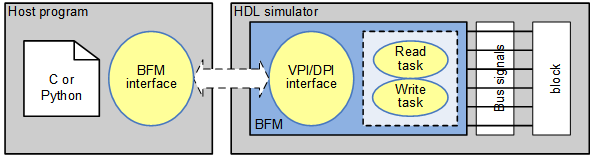

### <a name="con_fmc"></a>7.2 <a href="http://www.future-ds.com">Future Design Systems</a> <a href="http://www.future-ds.com/en/products.html#CON_FMC">CON-FMC<sup>TM</sup></a> project

#### 7.2.1 Gigabit Ethernet project

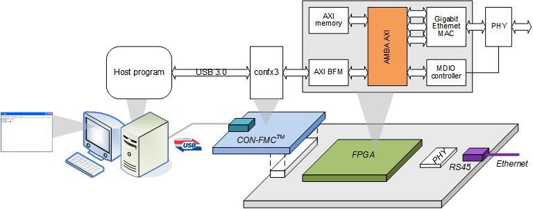

#### 7.2.2 AMBA AXI project

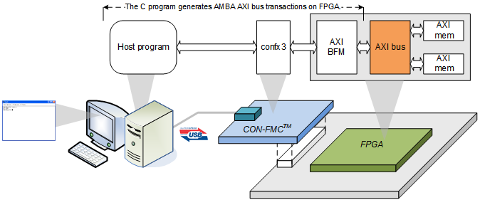

#### 7.2.3 AMBA AHB project

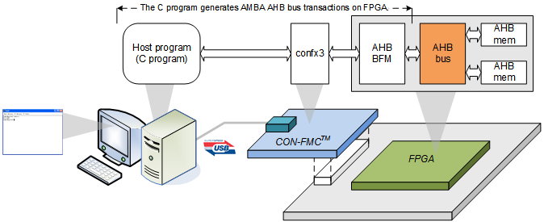

### 7.3 Core-A project

#### 7.3.1 Papers
* Ji-Hoon Kim, Jong-Yeol Lee, and Ando Ki, Core-A: A 32-bit Synthesizable Processor Core, IEIE Transactions on Smart Processing and Computing, vol. 4, no. 2, April 2015.

#### 7.3.2 Basic platforms
* Ando Ki, Platform Design using Core-A Processor (Core-A 프로세서를 활용한 플랫폼 설계), HongReung Publishing, 2010.

##### 7.3.2.1 Audio platform
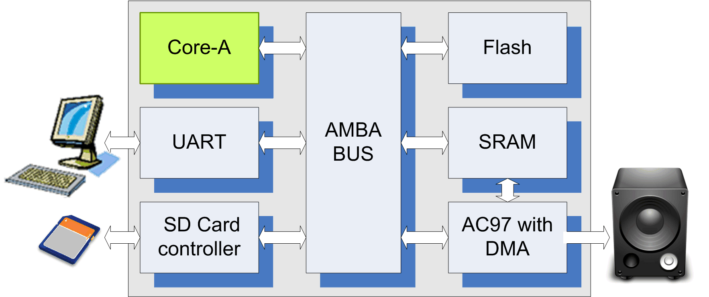

##### 7.3.2.2 Video platform
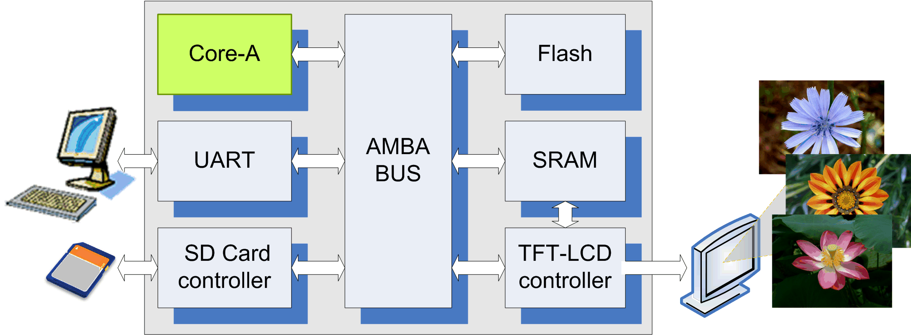

##### 7.3.2.3 Ethernet platform
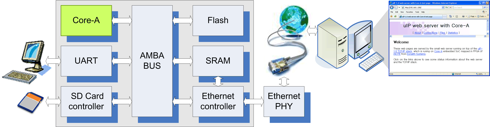

#### 7.3.3 Application platforms
* Ando Ki, Application Design using Core-A Processor (Core-A 프로세서를 활용한 응용 설계), HongReung Publishing, 2011.

##### 7.3.3.1 FAT file system
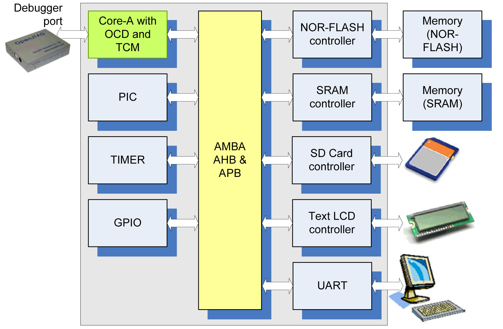

##### 7.3.3.2 uC/OS-II application
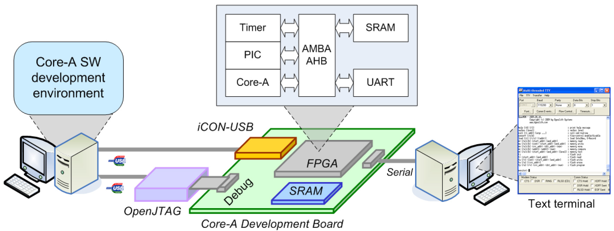

##### 7.3.3.3 FreeRTOS application
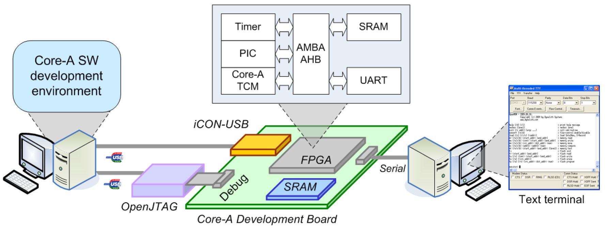

##### 7.3.3.4 JPEG application
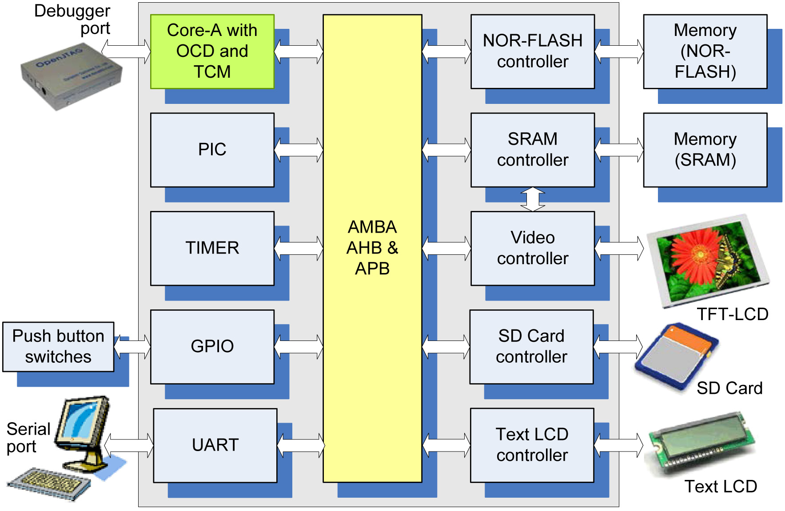

##### 7.3.3.5 MP3 application
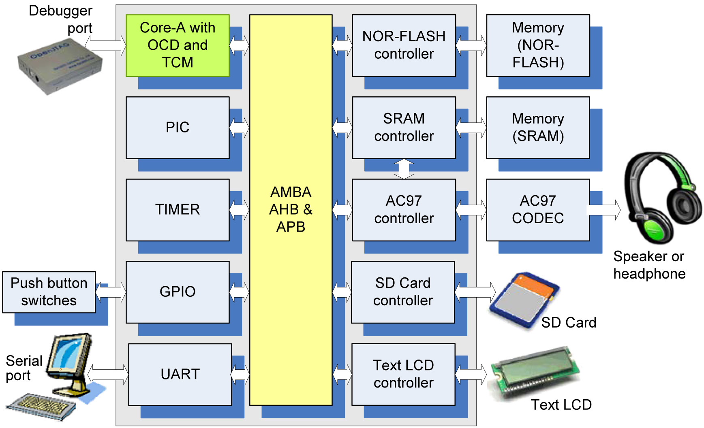

##### 7.3.3.6 Webserver application
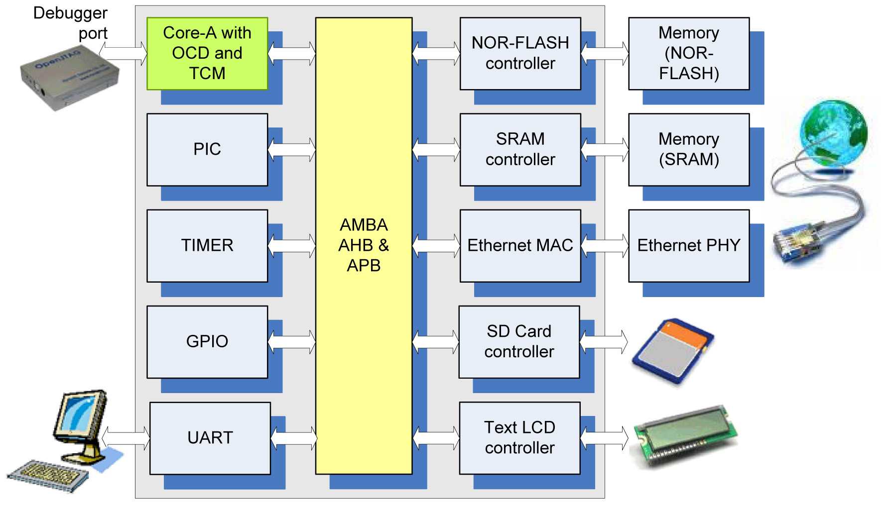

---
# 8. Other things<a name="other_things"></a>

### Author(s)
 * **Ando Ki** - *Initial work* - <a href="http://www.future-ds.com" target="_blank">Future Design Systems</a> and <a href="https://www.kaist.ac.kr" target="_blank">KAIST.</a>

### Acknowledgments
Thanks to all who gave me valuable feedback.

### Bug Fixes and Known Issues<a name="bug_fixes"></a>

#### Recent Bug Fixes (August 2025)
 * **W-Channel Routing Bug**: Fixed incorrect write data routing in multi-slave configurations
   - Location: `gen_axi_arbiter_mtos.c` lines 438-441
   - Fix: Changed from `fifo_pop_dout[WIDTH_SID-1:WIDTH_ID]==MID` to `fifo_pop_dout==WSID`
 * **Timescale Directive**: Added `\`timescale 1ns/1ps` to all generated RTL
   - Location: `main.c` line 50
 * **Slave Timing Issues**: Fixed slave read data timing in unified testbench
 * **Default Data Width**: Changed from 32-bit to 64-bit default

#### Known Limitations
 * Unified testbench may timeout for configurations larger than 2x2 (RTL is correct)
 * GUI VIP integration requires manual path configuration
 * Template path in `gen_axi_with_tb.sh` is hardcoded

### Revision history<a name="revision_history"></a>
 * 2025.08.20: Major update: W-channel routing bug fixed, unified testbench added, GUI integration complete
 * 2025.08.12: VIP enhanced with traffic monitoring, B-channel and AR/R channel fixes
 * 2025.08.06: GUI v3 with streamlined interface and direct RTL generation
 * 2023.07.16: Bug-fixed: SystemVerilog keyword conflict resolved.
               Simulation using Vivado XSIM in 'verification' uses SystemVerilog compiler.
               (Thanks 'dale40' for raising this issue.)<br>
 * 2021.09.05: Bug-fixed: 'ADDR_BASE' parameter updated to support address wider than 32-bit in 'gen_axi_top.sh'.
 * 2021.09.05: Bug-fixed: address range parameters changed from "32'h???" to "'h???" to support wider address width.
 * 2021.07.10: 'gen_amba_axi' option changed.
 * 2021.07.01: AMBA AXI4 feature applied, in which WID[..] removed.
 * 2021.06.01: M\?\_MID[..] removed.
 * 2021.06.01: '--axi3' option added in order to force to use AMBA AXI3 instead of AXI4.
 * A long time ago: Started by Ando Ki (adki(at)gmail.com).
---
