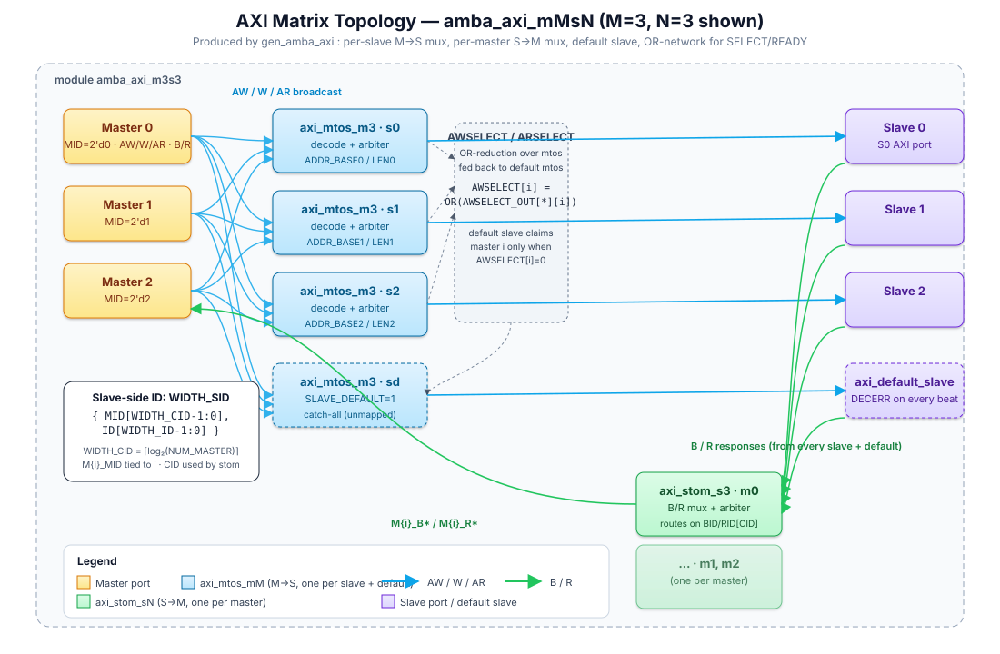
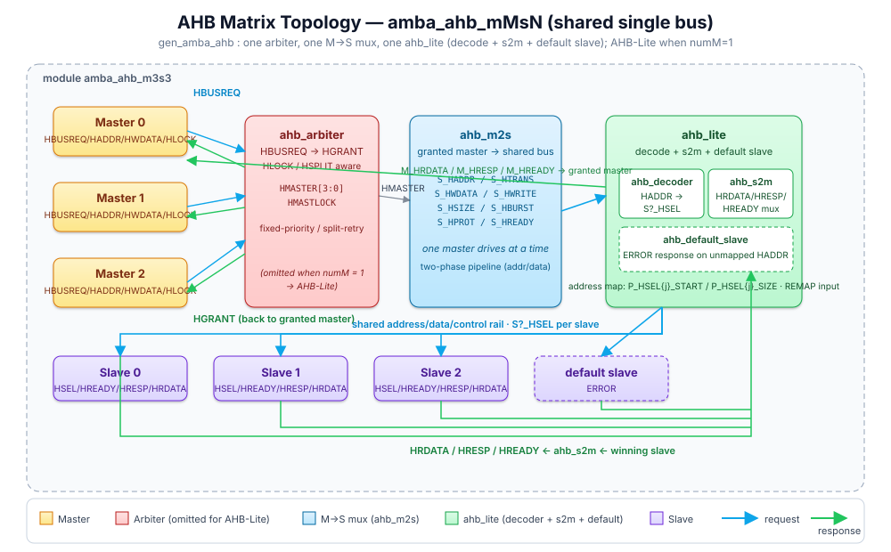
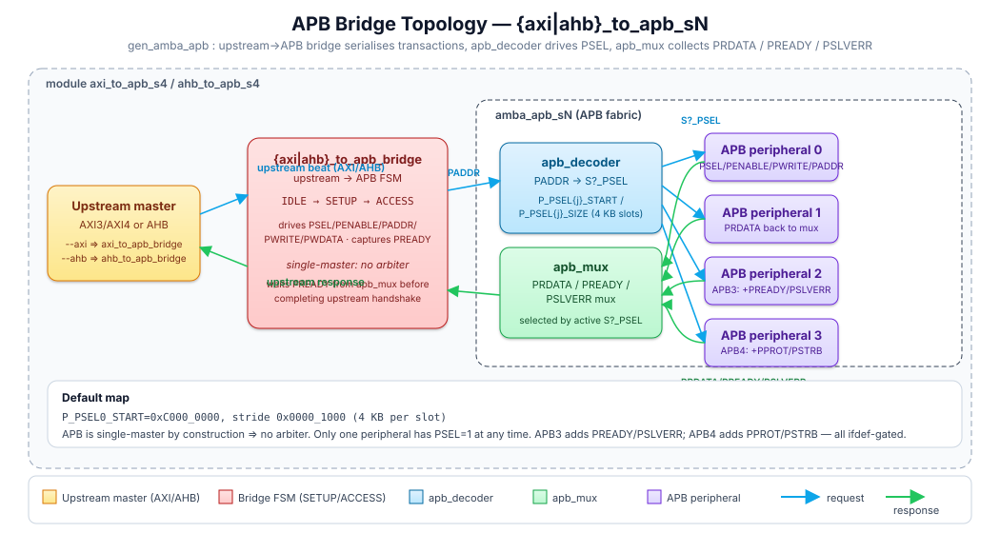

# GEN_AMBA_2025

**gen_amba_2025** is a suite of C programs that generate synthesizable Verilog RTL for AMBA bus
systems (AXI4/AXI3, AHB/AHB-Lite, APB) together with a UVM-based AXI4 Verification IP and a
Python GUI for visual bus-matrix design.

This document focuses on the **hardware generation architecture** — how the C generators turn
command-line parameters into parameterised Verilog modules, and how those modules compose into a
complete bus matrix.

---

## 1. Repository Layout

```
gen_amba_2025/
├── gen_amba_axi/        # AXI3/AXI4 crossbar generator (C sources + verification)
│   ├── src/             #   generator C sources
│   ├── verification/    #   BFM tasks, tb templates, sim Makefiles
│   └── gen_axi_with_tb.sh
├── gen_amba_ahb/        # AHB / AHB-Lite generator
│   ├── src/
│   └── verification/
├── gen_amba_apb/        # APB bridge generator (AXI→APB, AHB→APB)
│   ├── src/
│   └── verification/
├── axi4_vip/            # UVM AXI4 Verification IP + Python GUI (gui / gui_v3)
├── scripts/             # Helper Python scripts (integrated-top generator, etc.)
├── doc/                 # Diagrams, PDFs, reference material
├── IHI0022D_amba_axi_protocol_spec.pdf
├── arch.md  develop.md  TECHNICAL_DOCUMENTATION.md
└── Makefile             # Top-level recursive build
```

Each of `gen_amba_axi`, `gen_amba_ahb`, `gen_amba_apb` is a standalone C program producing a single
Verilog output file when invoked with `--master/--slave` parameters.

---

## 2. Hardware-Generation Flow (High Level)

All three generators follow the same pipeline:

```
  command line
      │
      ▼
  ┌────────────┐    ┌──────────────┐    ┌────────────────────┐    ┌─────────────┐
  │  main.c    │──▶ │ arg_parser.c │──▶ │ gen_<bus>_amba.c   │──▶ │ component   │
  │ (entry)    │    │ (options)    │    │ (orchestrator)     │    │ generators  │
  └────────────┘    └──────────────┘    └────────────────────┘    └─────────────┘
                                                                        │
                                                                        ▼
                                                         parameterised Verilog (stdout / file)
```

- `main.c` installs signal handlers, writes the file header (including ``` `timescale 1ns/1ps ```),
  then calls the top-level `gen_<bus>_amba()` entry point.
- `arg_parser.c` parses GNU-style long options (`--master`, `--slave`, `--prefix`, `--axi3`, the
  2025 feature flags `--enable-qos / --enable-region / --enable-user / --enable-firewall /
  --enable-cdc / --enable-ace-lite`, etc.) and fills module-level globals (`numM`, `numS`,
  `widthAD`, `widthDA`, `module`, `prefix`, `axi_features_t`).
- The bus-specific orchestrator calls the individual **component generators** in order; each writes
  one Verilog module to the same `FILE *fo`. The result is a self-contained Verilog file with the
  top-level interconnect plus every sub-module it instantiates.

### 2.1 Top-level API (AXI example — matches GEM_AMBA v0.3, PDF §1.9)

```c
int gen_axi_amba ( unsigned int numM, unsigned int numS,
                   unsigned int widthAD, unsigned int widthDA,
                   char *module, char *prefix,
                   int  axi4, axi_features_t *features, FILE *fo );
```

Return value: `0` on success, non-zero on failure. `numM >= 2` and `numS >= 2` are enforced;
`module` and `prefix` must be non-NULL. `axi_features_t` carries the 2025 feature toggles (QoS,
REGION, USER widths, firewall, CDC, ACE-Lite).

### 2.2 Size-dependent dispatch

For AXI, `gen_axi_amba()` switches between two back-ends:

| Matrix size              | Generator used                  | Why                                    |
| ------------------------ | ------------------------------- | -------------------------------------- |
| up to 8×8                | `gen_axi_amba_core` + components | Readable, per-signal wiring            |
| >8×8 (up to 64×64)       | `gen_axi_verilog_optimized`     | Vectorised wiring, memory-/perf-friendly |

The optimised path also auto-simplifies ACE-Lite for >16×16 matrices to keep generation time and
elaboration memory bounded.

---

## 3. Generated Bus Architecture (Hardware Topology)

The previous section described the C pipeline. This section describes what the pipeline actually
emits — the Verilog topology you get in the output file.

### 3.1 AXI matrix — `amba_axi_mMsN`



```
                 ┌─────────────────────── amba_axi_mMsN ────────────────────────┐
    M0 AXI ─────▶│  M0 port   ┐                                        ┌── S0  │──▶ S0 AXI
    M1 AXI ─────▶│  M1 port   │                                        │── S1  │──▶ S1 AXI
      ...        │     ...    ├── broadcast to every mtos ──▶  ...     │  ...  │
    M{M-1} AXI ─▶│  M{M-1}port┘                                        └── S{N-1}──▶
                 │                                                                │
                 │   ┌─────────── address decode + M→S mux (×N) ────────────┐     │
                 │   │  u_axi_mtos_s0  : SLAVE_ID=0, ADDR_BASE0, LEN0       │     │
                 │   │  u_axi_mtos_s1  : SLAVE_ID=1, ADDR_BASE1, LEN1       │     │
                 │   │   ...                                                │     │
                 │   │  u_axi_mtos_s{N-1}                                   │     │
                 │   │  u_axi_mtos_sd  : SLAVE_DEFAULT=1 (catch-all)        │     │
                 │   └──────────────────────────────────────────────────────┘     │
                 │                                                                │
                 │   ┌────────── response S→M mux (×M) ────────────────────┐      │
                 │   │  u_axi_stom_m0 … u_axi_stom_m{M-1}                  │      │
                 │   └──────────────────────────────────────────────────────┘     │
                 │                                                                │
                 │   u_axi_default_slave  (always DECERR)                         │
                 └────────────────────────────────────────────────────────────────┘
```

**Instance inventory** (emitted by `gen_axi_amba_core`):

| Instance                  | Count  | Role                                                          |
| ------------------------- | ------ | ------------------------------------------------------------- |
| `<prefix>axi_mtos_mM`     | N + 1  | One per real slave (plus one for the default slave)           |
| `<prefix>axi_stom_sN`     | M      | One per master; collects B/R from all slaves + default slave  |
| `<prefix>axi_default_slave` | 1    | Accepts any request, returns `DECERR` for every beat          |
| `<prefix>axi_wid`         | 0 or 1 | Only for `--axi3` (reconstructs the missing AXI4 `WID`)       |

Each `axi_mtos_mM` embeds one `ax_arbiter_mtos_mM` (per-slave arbitration across masters).
Each `axi_stom_sN` embeds one `axi_arbiter_stom_sN` (per-master arbitration across slave responses).

### 3.2 How a transaction flows through the matrix

**Write address (AW) / Read address (AR):**

1. Every master's `AW*` is fanned out to **every** `axi_mtos_s*` instance, including the default
   slave mux.
2. Inside each mtos, the address decoder compares `AWADDR[WIDTH_AD-1:ADDR_LENGTH]` against that
   slave's `ADDR_BASE` — if it matches and `SLAVE_EN=1`, that master is a candidate.
3. The internal arbiter picks one candidate master, raises `AWSELECT_OUT[master]`, and forwards
   the beat on `S_AWVALID`.
4. The default-slave mtos receives `AWSELECT_IN = OR(AWSELECT_OUT of every real mtos)`. It only
   claims a master whose bit is **not** set anywhere — i.e., an unmapped address — so exactly one
   mtos (real or default) accepts each request.

**Write data (W):** after the AW arbitration wins, the chosen slave's mtos also routes this
master's `WDATA/WSTRB/WLAST` through. On AXI4 the arbiter uses the full `WSID` (`CID || ID`) as the
match key — this is the 2025 W-channel fix (see §7).

**Response (B) / Read data (R):** the slave returns `BID/RID`, which carries the originating
master's `CID` in its top `WIDTH_CID` bits. The per-master `axi_stom_sN` decodes the `CID`, picks
the right slave/default-slave source, and drives `M?_BVALID`/`M?_RVALID` back.

**Ready collapsing:** each destination drives a private `M?_AWREADY_S?` / `M?_WREADY_S?` /
`M?_ARREADY_S?`; the top module OR-reduces them into `M?_AWREADY`, `M?_WREADY`, `M?_ARREADY`. The
same OR pattern collapses `S?_BREADY` and `S?_RREADY` back from every master's stom.

### 3.3 ID scheme

```
   ┌──────────────── WIDTH_SID (slave-visible ID) ────────────────┐
   │          WIDTH_CID         │          WIDTH_ID               │
   │   channel (master) index   │   user-facing transaction ID    │
   └───────────────┬────────────┴────────────────┬────────────────┘
                   │                             │
   auto = clog2(NUM_MASTER)        4 if NUM_MASTER≤16 else 8
```

- `M{i}_MID = i` is a constant tied by `gen_axi_amba_core`, so every request a master emits is
  tagged with its own channel number before reaching a slave.
- The slave sees `AWID = {MID, M{i}_AWID}` and must return it unchanged on `BID/RID`.
- The S→M path routes on the `CID` slice only, so user-level IDs never collide between masters.

### 3.4 Default address map

Unless overridden, `gen_axi_amba_core` assigns `ADDR_BASE0 = 0x0`, `ADDR_BASE1 = 0x2000`,
`ADDR_BASE{j} = j * 0x2000`, with `ADDR_LENGTH{j} = 12` (4 KB decode window). This is a placeholder
template — real designs override the parameters at instantiation time.

### 3.5 AHB matrix — multi-master top (generated when `--mst ≥ 2`)



```
           M0_HBUSREQ ┐                                      ┌─ S0_HSEL ─▶ slave0
           M1_HBUSREQ │                                      │─ S1_HSEL ─▶ slave1
            ...       │   u_ahb_arbiter   (HGRANT, HMASTER)  │   ...
           M{M-1}_..  ┘          │                           └─ S{N-1}_HSEL
                                 ▼
           M{i}_HADDR ──▶  u_ahb_m2s  ──▶  S_HADDR/HTRANS/HWDATA/HSIZE/HBURST/HPROT/HWRITE
                                                      │
                                                      ▼
                                            u_ahb_lite (decode + s2m)
                                            ┌──────────────────────────┐
                                            │ ahb_decoder → S?_HSEL    │
                                            │ ahb_s2m     → M_HRDATA / │
                                            │                M_HRESP / │
                                            │                M_HREADY  │
                                            │ ahb_default_slave (ERR)  │
                                            └──────────────────────────┘
```

- **Single shared bus**: only one master drives the slave fan-out at a time. `u_ahb_arbiter`
  computes `HGRANT` from `HBUSREQ`, honours `HLOCK`, and supports `HSPLIT`-driven re-arbitration;
  the granted master number is exported as `HMASTER` / `HMASTLOCK`.
- **Address map**: `P_HSEL{j}_START` / `P_HSEL{j}_SIZE` with a stride of `0x1000_0000` (or
  `0x0100_0000` for >16 slaves). `REMAP` input lets an external boot-ROM re-map slave 0.
- **Response path**: the slave mux (`ahb_s2m`) OR-selects `HRDATA/HREADY/HRESP` from the selected
  slave, and routes split-retry to the arbiter via `HSPLIT`.
- **AHB-Lite collapse**: when `numM == 1` the arbiter and `ahb_m2s` are **not emitted** — the top
  module is just `ahb_lite` (decoder + s2m + default slave), and the sole master drives the bus
  directly.

### 3.6 APB bridge — `{axi|ahb}_to_apb_sN`



```
    upstream (AXI or AHB)
            │
            ▼
    ┌─ axi2apb_bridge / ahb2apb_bridge ─┐
    │ setup → access state machine,     │
    │ PSEL/PENABLE/PWRITE/PADDR drive,  │
    │ PREADY/PSLVERR capture            │
    └─────────────┬──────────────────────┘
                  ▼
          amba_apb_sN
          ┌──────────────────┐
          │ apb_decoder      │──▶ S0_PSEL … S{N-1}_PSEL
          │ (PADDR match →   │
          │  P_PSEL{j}_START)│
          └──────────────────┘
                  ▼
          apb_mux  ──▶ M_PRDATA / M_PREADY / M_PSLVERR
```

- APB is single-master by construction, so there is **no arbiter**. The upstream→APB bridge
  serialises transactions.
- Default address map starts at `0xC000_0000`, slave stride `0x0000_1000` (4 KB slots).
- Optional signals are `ifdef`-guarded: `AMBA_APB3` adds `PREADY`/`PSLVERR`; `AMBA_APB4` adds
  `PPROT`/`PSTRB`.

### 3.7 Feature modules (optional, wired into the matrix when enabled)

| Flag                 | Module emitted                     | What it adds to the matrix                                      |
| -------------------- | ---------------------------------- | --------------------------------------------------------------- |
| `--enable-qos`       | `<prefix>axi_qos_arbiter`          | QoS-weighted arbitration inside each mtos (preserves AXI order) |
| `--enable-region`    | `<prefix>axi_region_*`             | Per-slave `AxREGION` encoding, constant within 4 KB             |
| `--enable-user`      | (parameters only)                  | `WIDTH_AWUSER/WUSER/BUSER/ARUSER/RUSER` exposed                 |
| `--enable-firewall`  | `<prefix>axi_firewall`             | Address/PROT-based access gate per master                       |
| `--enable-cdc`       | `<prefix>axi_cdc`                  | Async-FIFO CDC on each master or slave leg                      |
| `--enable-ace-lite`  | `<prefix>axi_ace_lite_*`           | `AxDOMAIN` / `AxSNOOP` / `AxBAR` ports and routing              |

All of these are instantiated *alongside* the base mtos/stom fabric — the core topology in §3.1
does not change; the feature modules slot in on the master legs (firewall/CDC/ACE-Lite) or on the
arbitration stage (QoS/REGION).

---

## 4. AXI Generator (`gen_amba_axi/src/`)

### 3.1 Call graph

```
main.c
 └── arg_parser.c
      └── gen_axi_amba.c                       (amba_axi_mXsY — top interconnect)
           ├── gen_axi_amba_core.c             (port list + parameters + signal wiring)
           ├── gen_axi_arbiter_mtos.c          (M→S arbiter, per slave)
           ├── gen_axi_arbiter_stom.c          (S→M arbiter, per master)
           ├── gen_axi_mtos.c                  (master-side mux / address decode)
           ├── gen_axi_stom.c                  (slave-side mux / response routing)
           ├── gen_axi_default_slave.c         (DECERR responder for unmapped addr)
           ├── gen_axi_wid.c                   (AXI3 WID management — skipped on AXI4)
           │
           ├── gen_axi_qos.c                   (QoS arbiter, --enable-qos)
           ├── gen_axi_region.c                (REGION encoder, --enable-region)
           ├── gen_axi_firewall.c              (security/PROT firewall, --enable-firewall)
           ├── gen_axi_cdc.c                   (async FIFO CDC, --enable-cdc)
           ├── gen_axi_ace_lite.c              (ACE-Lite coherency, --enable-ace-lite)
           ├── gen_axi_starvation_prevention.c (priority boosting)
           └── gen_axi_verilog_optimized.c     (large-matrix back-end)
```

### 3.2 What each component emits

- **Top interconnect (`amba_axi_mXsY`)** — exposes `M{i}_*` and `S{j}_*` AXI ports with standard
  AMBA naming. Parameters: `NUM_MASTER`, `NUM_SLAVE`, `WIDTH_CID` (auto-clog2 of `numM`),
  `WIDTH_ID`, `WIDTH_AD`, `WIDTH_DA`, `WIDTH_DS`, `WIDTH_SID = WIDTH_CID + WIDTH_ID`, and per-slave
  `ADDR_BASE{j}` / `ADDR_LENGTH{j}`.
- **M→S arbiter** — one instance per slave port; grants AW/W/AR channels to exactly one master at a
  time. Basic policy is fixed-priority / round-robin; QoS-aware arbitration is switched in when
  `--enable-qos` is set.
- **S→M arbiter** — one instance per master port; routes B/R responses back to the master that
  issued the transaction, using the channel-ID (`CID`) prefix of `BID`/`RID` (`WIDTH_SID =
  WIDTH_CID + WIDTH_ID`).
- **Master mux (`axi_mtos_mN`)** — address decode + request steering. Each master port holds
  compile-time `ADDR_BASE` / `ADDR_LENGTH` and `SLAVE_EN`; unmapped addresses are steered to the
  **default slave**.
- **Slave mux (`axi_stom_sN`)** — collects requests from every master into a single slave port and
  multiplexes responses back. The write-data channel is routed by the arbitrated `WSID` (this is
  the W-channel bug fix called out in §6).
- **Default slave (`axi_default_slave`)** — always accepts a transaction and returns `DECERR` for
  each beat. Prevents interconnect lock-up when an out-of-map address is issued.
- **AXI3 WID helper (`axi_wid`)** — only emitted when `--axi3` is set; tracks outstanding `AWID`s
  and pairs them with `WID` since AXI4 removed `WID`.

### 3.3 Parameter / macro contract (matches IHI0022D and GEM_AMBA v0.3)

| Parameter       | Meaning                                  | Constraints                     |
| --------------- | ---------------------------------------- | ------------------------------- |
| `NUM_MASTER`    | Master-port count                        | `>= 2`                          |
| `NUM_SLAVE`     | Slave-port count                         | `>= 2`                          |
| `WIDTH_CID`     | Channel-ID width                         | `ceil(log2(NUM_MASTER))`        |
| `WIDTH_ID`      | Transaction-ID width                     | 4 if `NUM_MASTER<=16`, else 8  |
| `WIDTH_AD`      | Address width                            | 8..64                           |
| `WIDTH_DA`      | Data width                               | 32/64/128/256/512/1024          |
| `WIDTH_DS`      | Strobe width                             | `WIDTH_DA/8`                    |
| `WIDTH_SID`     | Slave-side ID width                      | `WIDTH_CID + WIDTH_ID`          |

Feature macros (ifdef-guarded in emitted RTL): `AMBA_AXI_AWUSER`, `AMBA_AXI_WUSER`,
`AMBA_AXI_BUSER`, `AMBA_AXI_ARUSER`, `AMBA_AXI_RUSER`, `AMBA_AXI_CACHE`, `AMBA_AXI_PROT`,
`AMBA_QOS`.

### 3.4 Protocol constraints enforced in emitted RTL

- **4 KB boundary**: address decoders mask the low 12 bits so no single burst can cross a 4 KB
  region.
- **Burst types**: `FIXED` (`2'b00`), `INCR` (`2'b01`), `WRAP` (`2'b10`). Length ≤ 256 on AXI4,
  ≤ 16 on AXI3 / non-INCR.
- **Responses**: `OKAY` / `EXOKAY` / `SLVERR` / `DECERR`. Default slave is the only `DECERR`
  source.
- **Handshake**: `VALID` is stable once asserted until handshake; `READY` has no combinational path
  from `VALID`.

---

## 5. AHB Generator (`gen_amba_ahb/src/`)

### 4.1 Call graph

```
main.c
 └── arg_parser.c
      └── gen_ahb_amba.c                (top AHB matrix)
           ├── gen_ahb_arbiter.c        (ahb_arbiter — HGRANT generation)
           ├── gen_ahb_m2s.c            (master→slave mux)
           └── gen_ahb_lite.c           (chosen when --master=1)
                ├── gen_ahb_decoder.c   (HSEL decode)
                ├── gen_ahb_s2m.c       (slave→master mux, HRDATA/HRESP/HREADY)
                └── gen_ahb_default_slave.c (ERROR response for unmapped HADDR)
```

When `numM == 1` the orchestrator automatically emits the **AHB-Lite** variant (no arbiter, single
master). `--prefix` prevents module-name collisions when multiple AHB matrices live in the same
design.

### 4.2 Characteristics of the emitted RTL

- Two-phase AHB pipeline (address phase, data phase) with `HREADY` back-pressure propagation.
- Address decode: slot-based, configurable `HADDR_BASE[j]` / `HADDR_SIZE[j]`.
- Arbitration: fixed priority on `HBUSREQ`, with `HLOCK` honoured (locked transfers hold the grant).
- Response routing: `HRDATA` / `HREADY` / `HRESP` multiplexed back to the granted master every
  data-phase beat.

---

## 6. APB Bridge Generator (`gen_amba_apb/src/`)

### 5.1 Call graph

```
main.c
 └── arg_parser.c
      ├── gen_ahb2apb.c / gen_ahb2apb_bridge.c   (AHB → APB bridge, if --ahb)
      ├── gen_axi2apb.c / gen_axi2apb_bridge.c   (AXI → APB bridge, if --axi)
      └── gen_apb_amba.c                         (APB fabric)
           ├── gen_apb_decoder.c                 (PSEL decode)
           └── gen_apb_mux.c                     (PRDATA / PREADY / PSLVERR mux)
```

### 5.2 Supported APB flavours

- **APB3**: `PREADY` + `PSLVERR` wait-state and error reporting.
- **APB4**: adds `PPROT` (protection) and `PSTRB` (write-strobe per byte lane).

Only one APB peripheral is active at a time (single-master fabric), so the bridge is responsible
for converting the upstream AXI/AHB handshake into the APB setup/access sequence.

---

## 7. 2025 Enhancements

- **W-channel routing fix** (`gen_axi_arbiter_mtos.c:438-441`) — write-data steering now compares
  the full arbitrated `WSID` instead of only the `CID` slice, eliminating the multi-slave write
  mis-routing observed in 2x2+ configurations.
- **Timescale** — `` `timescale 1ns/1ps `` now emitted for every generated file (`main.c:50`).
- **Default data width**: 64-bit (was 32-bit).
- **Unified testbench generator** — `gen_axi_unified_tb.c` plus `gen_axi_with_tb.sh` produce a
  single testbench exercising the generated interconnect in `SIMPLE` / `COMPREHENSIVE` / `BURST` /
  `SLAVE` / `STRESS` / `ALL` modes via `+TEST_MODE=`.
- **Large-matrix back-end** (`gen_axi_verilog_optimized.c`) — supports 9×9 up to 64×64 with
  automatic simplifications for ACE-Lite / waveform depth / elaboration memory.
- **Integrated top helper** (`scripts/generate_integrated_top.py`) — wraps the generated crossbar
  plus enabled feature modules into a single project-named top module.

---

## 8. Build & Run

### 7.1 Build all generators

```bash
make                    # recurses into gen_amba_axi / _ahb / _apb
make cleanup            # remove executables & objects
make cleanupall         # also remove generated Verilog
```

### 7.2 Generate RTL

```bash
# AXI4 4x4 crossbar
./gen_amba_axi/gen_amba_axi --master=4 --slave=4 --output=amba_axi_m4s4.v

# AXI3 variant
./gen_amba_axi/gen_amba_axi --axi3 --master=2 --slave=2 --output=amba_axi3_m2s2.v

# AHB 2x3 (AHB-Lite auto-selected when --mst=1)
./gen_amba_ahb/gen_amba_ahb --mst=2 --slv=3 --out=amba_ahb_m2s3.v

# AXI-to-APB bridge with 4 APB slaves
./gen_amba_apb/gen_amba_apb --axi --slave=4 --out=axi_to_apb_s4.v

# RTL + unified testbench in one step
cd gen_amba_axi && ./gen_axi_with_tb.sh --master=2 --slave=3 \
     --output=design.v --tb=testbench.v
```

### 7.3 Simulate

```bash
cd gen_amba_axi/verification/sim/iverilog
make MST=2 SLV=3
gtkwave wave.vcd
```

Change `WIDTH_AD` / `WIDTH_DA` in `sim_define.v`, and enable individual scenarios via plus-args
(e.g. `+BURST_TEST=1`). Custom scenarios live in `axi_tester.v` and reuse the task library
`axi_master_tasks.v`.

---

## 9. Verification IP (UVM) and GUI

The generated RTL is designed to drop straight into the AXI4 VIP under `axi4_vip/`, which provides
UVM agents, sequences, scoreboard, coverage, and a Python GUI for visual bus-matrix design and
one-click VIP generation.

```bash
# Streamlined GUI (recommended)
cd axi4_vip/gui_v3 && ./launch_streamlined.sh

# VIP generation flow (selected from GUI "RTL Integration" mode) produces:
#   <output>/axi4_vip_env_rtl_integration/sim/Makefile
cd <output>/axi4_vip_env_rtl_integration/sim
make compile
make run_fsdb TEST=axi4_simple_crossbar_test
```

Implementation details of the VIP (BFMs, smart interconnect, QoS/USER/REGION agents, scoreboard,
CI/CD hooks) are documented in `CLAUDE.md` and `TECHNICAL_DOCUMENTATION.md`.

---

## 10. Prerequisites

- Bash
- GNU GCC
- Python 3.6+ with Tk (GUI); optional `pyyaml` for project save/load
- One of: Icarus Verilog, Xilinx xsim, Mentor ModelSim / Questa, Synopsys VCS, Cadence Xcelium

---

## 11. References

- ARM IHI 0022D — AMBA AXI Protocol Specification (`IHI0022D_amba_axi_protocol_spec.pdf`)
- GEM_AMBA v0.3 (July 2021) — `doc/gen_amba_20210710.pdf`
- `arch.md` — AXI4 VIP architecture (Chinese)
- `develop.md` — Implementation guide (Chinese)
- `TECHNICAL_DOCUMENTATION.md` — Component-level technical notes
- Upstream project: https://github.com/adki/gen_amba

## License

2-clause BSD. See individual source headers.

## Author

Initial work by **Ando Ki** (Future Design Systems / KAIST). 2025 enhancements and VIP integration
by the gen_amba_2025 contributors.
